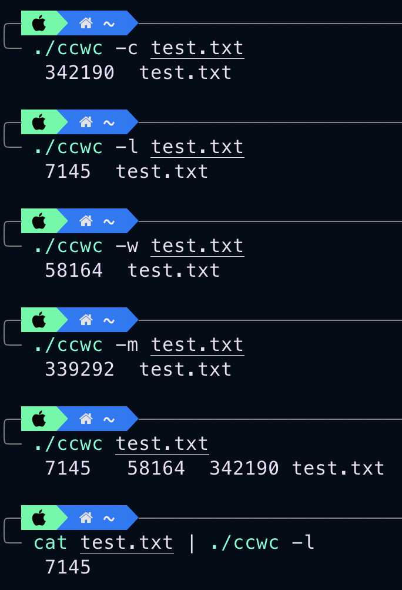

# Word Count

## Summary
* A challenge from the [Coding Challenge](https://codingchallenges.fyi/challenges/challenge-wc/)
* Build your own wc tool 

## Options
| Option |  Function |
| ------ | --------- |
| -c    | output the number of bytes in a file |
| ------ | --------- |
| -l   | output the number of lines in a file |
| ------ | -------- |
| -w   | output the number of words in a file |
| ------ | -------- |
| -m   | output the number of characters in a file |

## Screenshot

